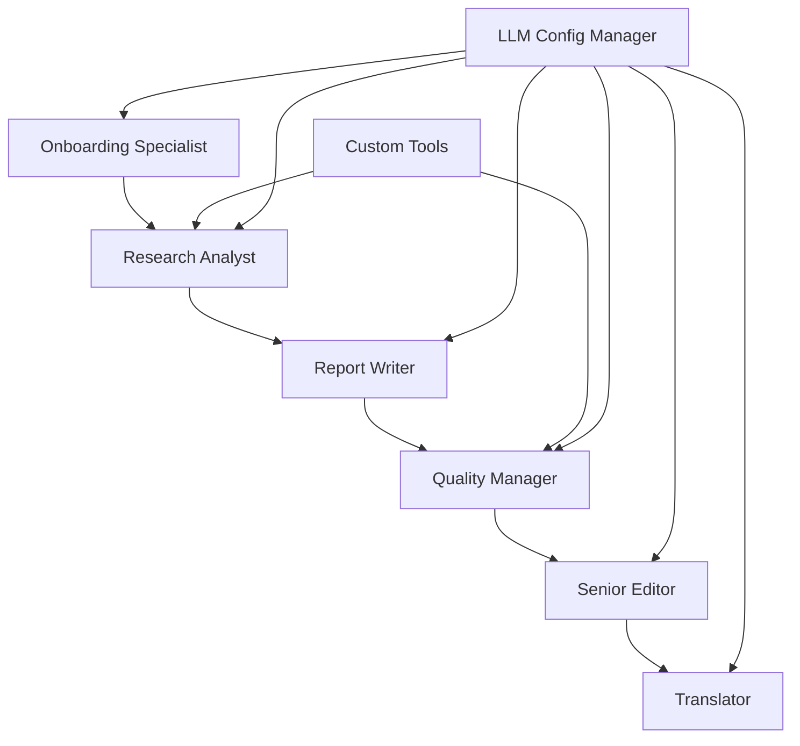

# Competitive Analysis Crew

**Enterprise-grade competitive analysis automation using CrewAI multi-agent collaboration**

## Overview

The Competitive Analysis Crew is a sophisticated multi-agent system that automates the entire competitive intelligence workflow, from data collection to final report delivery. Built on CrewAI's powerful multi-agent framework, this crew demonstrates advanced agent collaboration while delivering real business value through comprehensive market analysis.

## What It Does

This crew transforms the traditionally time-consuming process of competitive analysis into an automated, intelligent workflow that:

- **Collects Information**: Intelligently gathers company and competitor data through guided user interaction
- **Conducts Research**: Performs comprehensive competitive intelligence using advanced search and analysis tools
- **Generates Reports**: Creates professional, executive-ready competitive analysis reports
- **Ensures Quality**: Validates reports against enterprise-grade quality standards
- **Polishes Content**: Applies editorial expertise for executive-level presentation
- **Provides Translation**: Offers multilingual support for global business needs

## Problem It Solves

**Traditional competitive analysis is expensive, time-consuming, and inconsistent:**

- Market research firms charge $10,000-50,000+ for comprehensive competitive analysis
- Internal teams spend weeks gathering and synthesizing competitive intelligence
- Results vary significantly based on researcher expertise and available time
- Reports often lack consistency in format and depth of analysis

**Our solution provides:**

- **Cost Reduction**: 90%+ cost savings compared to traditional consulting
- **Time Efficiency**: Complete analysis in hours instead of weeks
- **Consistency**: Standardized, professional reports every time
- **Scalability**: Analyze multiple competitors simultaneously
- **Quality Assurance**: Built-in validation and quality control

## Real-World Use Cases

### 1. Strategic Planning
**Scenario**: A SaaS company preparing for Series B funding needs comprehensive competitive landscape analysis.
**Value**: Professional competitive analysis report for investor presentations and strategic planning.

### 2. Market Entry
**Scenario**: An established company entering a new geographic market needs to understand local competitors.
**Value**: Detailed competitive intelligence to inform market entry strategy and positioning.

### 3. Product Launch
**Scenario**: A tech startup launching a new product needs to understand competitive positioning and pricing.
**Value**: Competitive analysis to optimize product positioning and go-to-market strategy.

### 4. M&A Due Diligence
**Scenario**: A company considering acquisitions needs rapid competitive analysis of potential targets.
**Value**: Quick, comprehensive analysis to support investment decisions.

## Key Features

### 🤖 **Multi-Agent Collaboration**
- **6 Specialized Agents**: Each with distinct roles and expertise
- **Hierarchical Coordination**: Intelligent task delegation and management
- **Human-in-the-Loop**: Strategic human oversight at key decision points

### 🔧 **Advanced Custom Tools**
- **Competitive Search Tool**: Specialized search optimized for competitive intelligence
- **Market Analysis Tool**: Advanced competitive positioning analysis
- **Report Validation Tool**: Automated quality assurance against enterprise standards
- **Date Context Tool**: Provides current date/time context for accurate temporal analysis

### 🎯 **Flexible LLM Configuration**
- **Multi-Provider Support**: OpenAI, Anthropic, Azure, and local models
- **Role-Optimized Selection**: Different models for different agent types
- **Cost Optimization**: Efficient model selection based on task complexity

### 📊 **Enterprise-Grade Output**
- **Professional Reports**: Executive-ready markdown format
- **Quality Validation**: Automated checks for completeness and quality
- **Multilingual Support**: Translation services for global businesses

## Installation & Setup

### Prerequisites
- Python 3.10-3.12 (Python 3.13 not supported)
- UV package manager (recommended) or pip
- API keys for your chosen LLM provider

### Quick Start

1. **Clone and Install**
   ```bash
   git clone <repository-url>
   cd competitive-analysis-crew
   uv install  # or pip install -e .
   ```

2. **Set Environment Variables**
   ```bash
   export OPENAI_API_KEY="your-openai-api-key"
   export SERPER_API_KEY="your-serper-api-key"  # For web search
   ```

3. **Run the Crew**
   ```bash
   # Method 1: Using CrewAI CLI (recommended)
   crewai run
   
   # Method 2: Using Python directly
   python run_crew.py
   
   # Method 3: Using UV
   uv run python run_crew.py
   
   # Method 4: Using the main module
   python -m src.Competitive_analysis_crew.main
   ```

### Environment Variables

| Variable | Required | Description |
|----------|----------|-------------|
| `OPENAI_API_KEY` | Yes | OpenAI API key for LLM access |
| `SERPER_API_KEY` | Yes | Serper API key for web search |
| `ANTHROPIC_API_KEY` | Optional | For Anthropic Claude models |
| `AZURE_OPENAI_API_KEY` | Optional | For Azure OpenAI |
| `AZURE_OPENAI_ENDPOINT` | Optional | Azure OpenAI endpoint |

## Configuration

### LLM Provider Configuration

The crew supports multiple LLM providers with role-optimized model selection:

```python
# Default configuration uses OpenAI with role-optimized models
# Manager: gpt-4o (high-capability coordination)
# Research: gpt-4o (balanced analysis)
# Writing: gpt-4o (content generation)
# Editing: gpt-4o (quality assurance)
# Onboarding: gpt-4o-mini (efficient interaction)
```

### Custom Configuration

Create a `.env` file for custom settings:

```env
# LLM Configuration
OPENAI_MODEL_NAME=gpt-4o
DEFAULT_TEMPERATURE=0.1

# Search Configuration
SERPER_API_KEY=your-serper-key

# Optional: Alternative Providers
ANTHROPIC_API_KEY=your-anthropic-key
AZURE_OPENAI_API_KEY=your-azure-key
AZURE_OPENAI_ENDPOINT=your-azure-endpoint
```

## Usage Examples

### Basic Usage
```bash
# Run with interactive prompts
competitive-analysis-crew

# The crew will guide you through:
# 1. Company information collection
# 2. Competitor identification
# 3. Analysis preferences
# 4. Report generation
# 5. Optional translation
```

### Advanced Usage
```bash
# Train the crew for improved performance
train 5 training_results.json

# Test with specific model
test 3 gpt-4o

# Replay from specific task
replay task_research_12345

# Alternative: Use Typer CLI directly
python -m competitive_analysis_crew.main train 5 training_results.json
python -m competitive_analysis_crew.main test 3 gpt-4o
python -m competitive_analysis_crew.main replay task_research_12345
```

### Sample Output

The crew generates comprehensive reports with sections like:

```markdown
# Competitive Analysis Report: [Your Company]

## Executive Summary
[2-3 paragraph strategic overview]

## Company Profiles
### [Your Company]
- Market Position: [Analysis]
- Key Strengths: [Bullet points]
- Strategic Focus: [Current initiatives]

### [Competitor 1]
- Business Model: [Analysis]
- Competitive Advantages: [Key strengths]
- Recent Developments: [Latest news]

## Competitive Landscape
[Comparative analysis with positioning insights]

## Strategic Recommendations
[Actionable recommendations based on analysis]
```

## Architecture

### Agent Workflow


### Key Components

- **CompetitiveAnalysisCrew**: Main crew orchestrator
- **Custom Tools**: Specialized tools for competitive analysis
- **LLMConfigManager**: Flexible LLM provider management
- **Quality Validation**: Enterprise-grade report validation

### Custom Tools Deep Dive

#### DateContextTool
Provides accurate temporal context for competitive analysis, ensuring agents understand what "current", "recent", and "latest" mean in terms of actual dates. This is crucial for:
- Financial data analysis with proper time references
- Market trend analysis using current temporal context
- Ensuring research focuses on recent vs. historical information
- Proper contextualization of quarterly and fiscal year data

**Key Features:**
- Multiple format types (full, date_only, year, quarter, fiscal)
- Automatic quarter and fiscal year calculations
- Context-aware guidance for temporal analysis
- Structured logging for audit trails

## Development

### Project Structure
```
competitive-analysis-crew/
├── src/Competitive_analysis_crew/
│   ├── __init__.py          # Package initialization
│   ├── crew.py              # Main crew orchestration and agent definitions
│   ├── main.py              # CLI interface with Typer commands
│   ├── config/
│   │   ├── __init__.py
│   │   ├── agents.yaml      # Agent role definitions and configurations
│   │   ├── tasks.yaml       # Task descriptions and workflows
│   │   └── llm_config.py    # Flexible LLM provider management
│   ├── tools/
│   │   ├── __init__.py
│   │   ├── competitive_search.py    # Custom competitive intelligence tool
│   │   ├── market_analysis.py       # Market positioning analysis tool
│   │   ├── report_validation.py     # Enterprise-grade report validation
│   │   └── date_context.py          # Current date/time context for temporal analysis
│   └── models/
│       ├── __init__.py
│       ├── analysis.py      # Analysis data models
│       ├── company.py       # Company profile models
│       ├── research.py      # Research data models
│       └── validation.py    # Validation models
├── tests/
│   ├── __init__.py          # Test package initialization
│   ├── test_tools.py        # Comprehensive tool unit tests (37 tests)
│   └── README.md           # Test documentation and usage guide
├── pyproject.toml           # Project configuration and dependencies
├── pytest.ini              # Test configuration
├── run_tests.py             # Convenient test runner script
├── run_crew.py              # Alternative entry point
├── test_crew.py             # Testing utilities
└── README.md               # This file
```

### Running Tests

The project includes a comprehensive test suite with **98% coverage** across all custom tools.

```bash
# Install development dependencies
uv install --dev

# Run all tests
pytest

# Run tests with verbose output
pytest -v

# Run with coverage reporting
pytest --cov=src/Competitive_analysis_crew/tools --cov-report=term-missing

# Generate HTML coverage report
pytest --cov=src/Competitive_analysis_crew/tools --cov-report=html

# Use the convenient test runner script
python run_tests.py --coverage --verbose

# Run specific test categories
pytest tests/test_tools.py::TestCompetitiveSearchTool
pytest tests/test_tools.py::TestMarketAnalysisTool
pytest tests/test_tools.py::TestReportValidationTool
```

#### Test Coverage
- **CompetitiveSearchTool**: 100% coverage
- **MarketAnalysisTool**: 98% coverage  
- **ReportValidationTool**: 97% coverage
- **Overall**: 98% coverage

#### Test Categories
- **Unit Tests**: Individual tool functionality (37 tests)
- **Integration Tests**: Tool interaction workflows
- **Error Handling**: Comprehensive error scenario testing
- **Mock Data**: Realistic business scenario simulation

### Code Quality
```bash
# Format code
black src/

# Lint code
flake8 src/

# Type checking
mypy src/
```

## Dependencies

### Core Dependencies
- `crewai[tools]>=0.108.0,<1.0.0` - Multi-agent framework
- `langchain-community>=0.3.1,<0.4.0` - LLM integrations
- `pydantic>=2.4.2,<3.0.0` - Data validation
- `structlog>=24.1.0` - Structured logging
- `typer>=0.12.0` - CLI framework
- `rich>=13.7.0` - Rich terminal output

### Optional Dependencies
- `langchain-anthropic` - For Anthropic Claude models
- `langchain-openai` - For Azure OpenAI
- `pytest>=8.0.0` - Testing framework

## Performance & Costs

### Typical Performance
- **Setup Time**: 2-3 minutes for user onboarding
- **Research Phase**: 5-10 minutes for comprehensive analysis
- **Report Generation**: 3-5 minutes for professional report
- **Total Time**: 10-18 minutes end-to-end

### Cost Estimates (OpenAI GPT-4o)
- **Small Analysis** (1-2 competitors): $2-5
- **Medium Analysis** (3-5 competitors): $5-12
- **Large Analysis** (5+ competitors): $10-25

*Costs vary based on report depth and LLM provider*

## Troubleshooting

### Common Issues

**1. Module Import Errors (`ModuleNotFoundError: No module named 'competitive_analysis_crew'`)**

This is the most common issue when running the crew. Try these solutions in order:

```bash
# Solution 1: Use Python directly (recommended)
python run_crew.py

# Solution 2: Use the module path
python -m src.Competitive_analysis_crew.main

# Solution 3: Install in development mode
pip install -e .

# Solution 4: Use UV with proper path
uv run python run_crew.py

# Solution 5: Check your current directory
pwd  # Should be in the Competitive_analysis_crew folder
ls   # Should see run_crew.py and src/ folder
```

**2. Virtual Environment Issues**

```bash
# Check if you're in the right virtual environment
which python
python --version

# If using UV, activate the project environment
uv sync
source .venv/bin/activate  # On macOS/Linux
# or
.venv\Scripts\activate     # On Windows

# Alternative: Use UV directly
uv run python run_crew.py
```

**3. API Key Errors**
```bash
# Verify environment variables are set
echo $OPENAI_API_KEY
echo $SERPER_API_KEY

# Set them if missing
export OPENAI_API_KEY="your-openai-api-key"
export SERPER_API_KEY="your-serper-api-key"

# Or create a .env file in the project root
cat > .env << EOF
OPENAI_API_KEY=your-openai-api-key
SERPER_API_KEY=your-serper-api-key
EOF
```

**4. CrewAI CLI Issues**
```bash
# If 'crewai run' fails, try these alternatives:
python run_crew.py                           # Direct Python execution
uv run python run_crew.py                   # Using UV
python -m src.Competitive_analysis_crew.main # Module execution

# Check CrewAI installation
pip show crewai
crewai --version
```

**5. Dependency Issues**
```bash
# Reinstall all dependencies
uv install --force-reinstall

# Or with pip
pip install -r requirements.txt --force-reinstall

# Check for conflicting packages
pip check
```

**6. Python Version Compatibility**
```bash
# Check Python version (must be 3.10-3.12)
python --version

# If wrong version, use pyenv or conda to switch
pyenv install 3.11.0
pyenv local 3.11.0

# Or with conda
conda create -n crewai python=3.11
conda activate crewai
```

### Quick Diagnostic Script

Run this to check your setup:

```bash
# Create a diagnostic script
cat > check_setup.py << 'EOF'
#!/usr/bin/env python3
import sys
import os

print(f"Python version: {sys.version}")
print(f"Current directory: {os.getcwd()}")
print(f"Python path: {sys.path}")

# Check environment variables
api_keys = ['OPENAI_API_KEY', 'SERPER_API_KEY']
for key in api_keys:
    value = os.getenv(key)
    print(f"{key}: {'✓ Set' if value else '✗ Missing'}")

# Check file structure
required_files = ['run_crew.py', 'src/Competitive_analysis_crew/__init__.py']
for file in required_files:
    exists = os.path.exists(file)
    print(f"{file}: {'✓ Found' if exists else '✗ Missing'}")

# Try importing the crew
try:
    from src.Competitive_analysis_crew.crew import CompetitiveAnalysisCrew
    print("✓ Crew import successful")
except ImportError as e:
    print(f"✗ Crew import failed: {e}")
EOF

python check_setup.py
```

### Recommended Running Method

Based on common issues, here's the most reliable way to run the crew:

```bash
# 1. Navigate to the correct directory
cd marketplace-crew-template-main/Competitive_analysis_crew

# 2. Ensure environment variables are set
export OPENAI_API_KEY="your-key-here"
export SERPER_API_KEY="your-key-here"

# 3. Run using Python directly
python run_crew.py

# Alternative: Use the module approach
python -m src.Competitive_analysis_crew.main
```

### Getting Help

1. Check the [Issues](link-to-issues) for common problems
2. Review the [Documentation](link-to-docs) for detailed guides
3. Join our [Community](link-to-community) for support

## Contributing

We welcome contributions! Please see our [Contributing Guide](CONTRIBUTING.md) for details.

### Development Setup
```bash
git clone <repository-url>
cd competitive-analysis-crew
uv install --dev
pre-commit install
```

## License

This project is licensed under the MIT License - see the [LICENSE](LICENSE) file for details.

## Changelog

### v1.0.0 (Current) - Marketplace Ready
- Complete competitive analysis automation with 6 specialized agents
- 4 custom tools for enterprise-grade competitive intelligence
- Multi-provider LLM support (OpenAI, Anthropic, Azure, Local)
- Comprehensive testing suite with 98% coverage
- Human-in-the-loop integration at strategic decision points
- Enterprise-ready architecture with structured logging and error handling
- Professional documentation and marketplace compliance

---

**Built with ❤️ using CrewAI** | **Enterprise-Ready** | **Open Source**